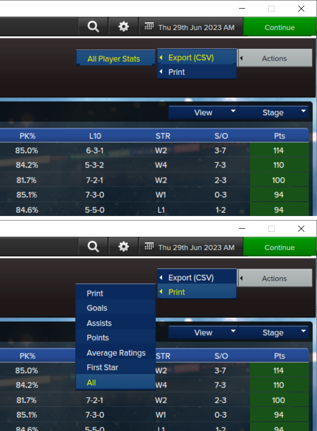

# Nice Stats for Eastside Hockey Manager
  

:rocket: Nicely presented player statistics for Eastside Hockey Manager saved games saved to a simple Excel spreadsheet. 

:construction: This tool is a work in progress. Only skaters and regular season stats are currently supported. I plan to add goalies and playoff stats in the near future together with a limited range of graphs/charts.

Find more tools for Eastside Hockey Manger on [The Blue Line](https://ehmtheblueline.com).

## How to Use

 - Load your saved game in EHM;
 - Navigate to the league standings screen for the league of your choice;
 - Near the top right corner of the screen there is an `Actions` button. Click on this and then each of the following:
         - `Print` -> `All` and save this to a folder of your choice. This is your `League Standings` file; and
         - `Export (csv)` -> `All player stats` and save this to a folder of your choice. This is your `Player Statistics` file;
 - Load the Nice Stats app and select the `League Standings` and `Player Statistics` files you saved per the previous step; and
 - Choose where to save your spreadsheet in the `Save As` setting and then click`Generate`.

You can repeat the above steps as often as you like during your saved game (e.g. early season, mid season, end of season, etc).

## Author
[@archibalduk](https://www.github.com/archibalduk)

## Credits
Thanks to [@LoganTheSpursyOne](https://discord.com/) on Discord whose spreadsheets gave me the idea to create this tool.
Nice Stats uses [QXlsx by j2doll](https://github.com/QtExcel/QXlsx). QXlsx is licensed under the MIT license.

## License
[GNU General Public License v3.0](https://choosealicense.com/licenses/gpl-3.0/)
